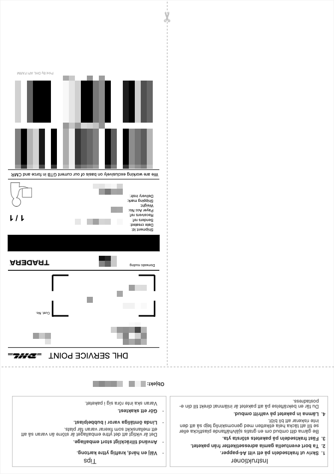
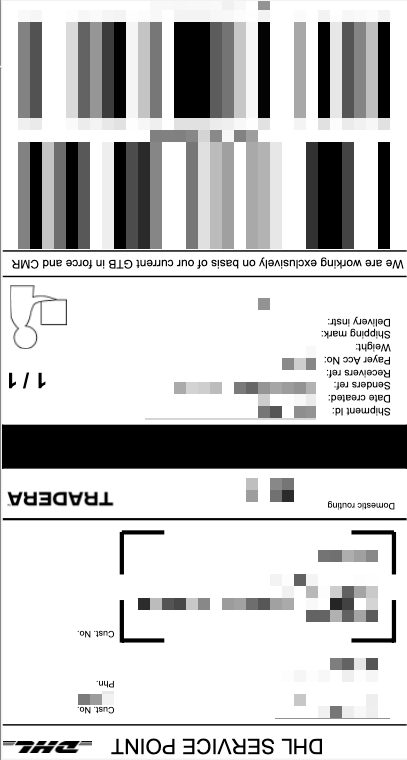

# Tradera Crop

Traderas fraktsedlar kommer i PDF-format och innehåller en massa onödigt innehåll, vilket gör att det inte går att skriva ut (A4) på en etikettskrivare (Vretti 4x6 inch). Detta skript tar en PDF-fil som argument och skapar en ny PDF-fil med etiketten i rätt storlek.

Skriptet är skrivet i Python 3.12 på macOS och har beroende på PyPDF, som enklast installeras med `pip` och den medföljande `requirements.txt`-filen:

```bash
$ pip install -r requirements
```

Usage:

```bash
$ python traderacrop.py <pdf file>
``` 

Example:

```bash
$ python traderacrop.py frakt.pdf
File cropped_frakt.pdf created
```

Har du nytta av skriptet och vill bjuda på en kopp kaffe gör du det enklast med kort (VISA/Mastercard) på <a href="https://revolut.me/jonasbjork">revolut.me/jonasbjork</a> 


# Exempel på hur det ser ut

Här har vi fraktsedeln som vi fått från Tradera, i A4-format:



När vi kört fraktsedeln (filen) genom skriptet får vi tillbaka:


